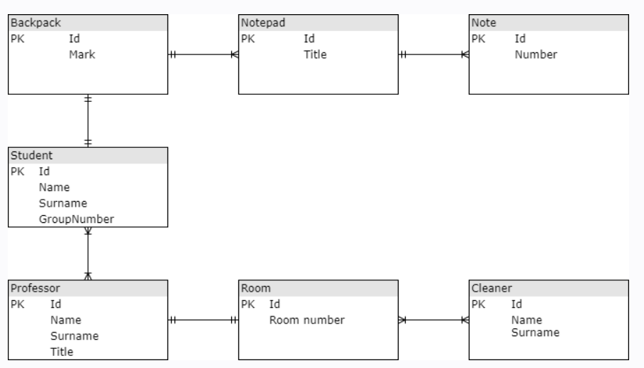
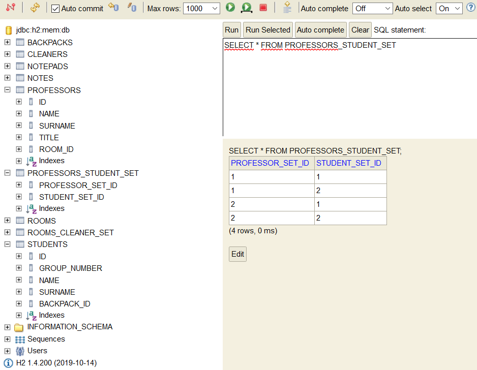

# AS_SQL_Relationships
[*Spring boot 2 academy*](https://www.akademiaspring.pl/)

## General
Implementation of DB model using Hibernate.

## DB model

## Configuration

application.properties file:

    spring.datasource.platform=h2
    spring.datasource.url=jdbc:h2:mem:db
    spring.h2.console.enabled=true
    spring.h2.console.path=/console
    spring.jpa.hibernate.ddl-auto=create

## Technologies
- Java 11
- Maven
- Spring Boot 2.4.0
- H2 Database
- Hibernate

## Screenshots

